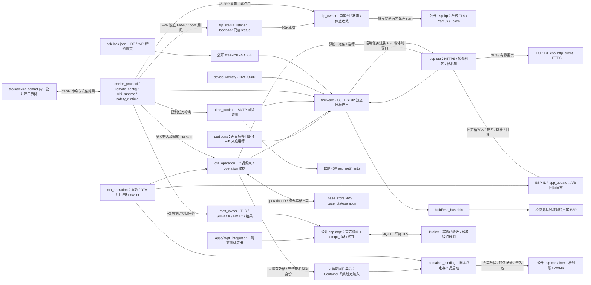

# ESP Base

基于公开 ESP-IDF v6.1 维护 fork 的设备业务基座。当前具备持久 UUID、硬件事实、心跳、分区、配置事务、Wi-Fi station、本次启动 SNTP 时间同步门、USB status/restart/config.set 协议、配置后启动的严格 TLS MQTT 命令通道，以及 OTA pending 新槽本地确认。受控签名构建还具备 `ota.start` 下载和按 operation ID 查询 `ota.result` 持久收据的软件链，并提供只读、失败保守拒绝的双应用槽固件身份观察接口，供未来 Container 绑定。FRP 已接入公开组件和单 owner；受控 loopback 管理端点已有只读 `status` 软件候选，能在绑定成功后开放 FRP 启动门，但尚无同板资源及真实 FRPS 闭环；当前实板仍是未签名旧基座，五能力完整验收尚未完成。

## 架构拓扑



## 开发

```bash
source "$IDF_PATH/export.sh"
idf.py -C firmware build
```

2026-09-26 五仓源码候选已更新 FRP、MQTT、OTA 的唯一依赖锁及可选 Container 清单。C3 专属配置进一步关闭未使用的 SoftAP 并只保留 TLS 客户端：固定 SDK 的普通 C3 构建为 898800 字节，测试键签名 C3 构建为 1052672 字节且 RSA v2 验签通过；Base host ASan/UBSan 全套、离线预检假件 12/12、串口伪终端 5/5 通过。Container 探针只完成组件编译，主应用未链接包操作入口；此后 ESP32 新增独立分区、OTA/ECDSA v1 策略和旧 AT 可逆归档的软件候选，P7-02 五能力运行组合与实板验收尚未完成。各制品 SHA-256、精确锁、可选组件链接范围见[开发检查点](docs/operations/development-checkpoint.md)。

2026-09-27 主应用已接入既有 confirmed Container 绑定的真实启动入口，使用 Base 已持有的 owner、精确分区事实、仓外信任锚及独立授权；缺输入、无绑定和 pending 各自明确处理。固定 SDK 双目标构建和 host 测试通过；仓外 RSA 测试公钥与 ESP32 候选布局使离线 ELF 实际包含 Container open/init、IDF provider 与 WAMR。默认 C3 因没有包分区和产品授权，不可运行 guest。联合 OTA 还缺新固件选 boot 前的候选观察与 Container 持久转换合同，P6-03/P7-02 和实板验收保持未完成。详见[产品装配](firmware/integrations/container_binding/README.md)。

此前低内存与双目标整合候选的普通 C3 构建为 957904 字节、SHA-256 `727cbde420c661cb54fc9ff0c24c119be55bb5845b58022070d5086b6b178a0d`。P1-04 C3 私有双份 Flash 的**真实**只读预检因 `base_store` 后 31 页不是有效 NVS 页而阻断，没有生成 v3 候选。此前 ESP32 仓外副本以临时 ECDSA P-256 测试键构建的签名 Base 为 `0xffff4` 字节，离线验签有效；其早期三包槽各仅 `0x60000`，不能作为目标布局。本轮产品源码使用公开容量报告中的双 `0x120000` app、三 `0x82000` 包槽、16 KiB 旧 AT 原始归档区及 `0x16000` Base NVS；该离线候选不授权刷写。P2-08/P6-03 仍在进行中。

C3 `base_store` 后 31 页的脱敏逐页字节计数和旧 `ota_1` 同字节映射见[异常页只读分类](docs/operations/c3-base-store-page-forensics.md)；来源与处置仍未确认，迁移预检继续阻断。

`IDF_PATH` 指向 [sdk-lock.json](sdk-lock.json) 固定的公开 ESP-IDF v6.1 fork `578cf89c343e388db43ba1f4ddcd602fedcb763c`，其 lwIP 子模块固定为公开 `esp-lwip@2758df4cd3666b3b2a5b53830148379326425c0d`；准备及检查见[宿主工具](tools/README.md#sdk-源码准备)。构建会核对这两个提交、SDK 工作树、其他子模块及实际 lwIP 组件路径。其余依赖来自本仓、官方 cJSON 和 Component Manager 锁定的公开 `esp-mqtt@9d6d95e779f4f5ff387a6d9b54015bf4e43565f2`、`esp-ota@207273188b984161362824c3344614e812016836`、`esp-frp@1f0c8f37db3765a74b3b95871bb266d0c73d1248`，不读取工作区相邻仓库。普通基座的软件候选使用 v3 配置；MQTT 的 HMAC、Topic 和 ClientID 合同未变，无凭据时不创建客户端。FRP 有独立 Token、CA、代理名和管理 key，loopback `status` listener 未绑定时不创建连接；完整请求合同见[设备协议](docs/design/device-protocol.md#frp-base-软件接线边界)。隔离测试应用直接调用 `emqtt_` 接口。构建制品和实板结论以[开发检查点](docs/operations/development-checkpoint.md)为准；编译不写设备。

NVS 初始化失败时保留原分区并停止初始化，不自动擦除。Base 身份使用 `nvs/base_identity/device_uuid`；C3 分区保持原迁移基线，旧 ESP-AT 的 ESP32 没有可沿用的 Base UUID，须在新布局首次启动时建立独立身份。配置 `base_store/base_config/committed` 只接受 v3，旧 v1/v2 记录会使启动停止且不写入；现有实板必须在完整 Flash 备份、两槽与同一 NVS key 离线迁移验证后才可首次启动该镜像。只读预检和候选见[离线迁移](docs/operations/base-v3-offline-migration.md)。C3 与 ESP32-D0WD-V3 均按各自 4 MiB 布局独立构建，无 GPIO 动作。ESP32 的 UART0/CH340 控制入口、产品分区与 ECDSA v1 OTA 约束已有软件候选，但旧 ESP-AT 启动链、身份、持久区和新 Base 不能直接混用；需保留完整旧 Flash、仓外旧持久区归档、双签名 Base 与恢复步骤，再另行受控实板迁移。[旧 AT 配置只读检查点](docs/operations/esp32-at-nvs-readonly-checkpoint.md)说明现物 Wi-Fi 空值、MAC 与新 UUID 的边界，以及原始归档与活动配置迁移的区别。

pending OTA 槽只在身份、配置、USB 控制任务初始化成功，控制循环实际开始、在本地 30 秒窗口内持续报告进展，且跨过窗口终点再完成一轮后确认。Wi-Fi 初始化失败时状态为 `failed`，USB 控制仍启动，不因此回滚；窗口内 `config.set` 返回 `ota_verification_pending`，确认成功后恢复；不等待 Wi-Fi、Broker 或 FRPS 在线。确认 SDK 报错但 otadata 已为 VALID 时按持久状态清门。启动或活性检查失败时由 IDF 尝试回滚；无可回退镜像时当前执行暂留，但下次复位不保证可启动，需人工恢复。

普通应用使用编译期 `CONFIG_ESP_BASE_TIME_SERVER`（默认 `pool.ntp.org`）启动官方 SNTP。本次启动收到同步事件且时间合理后才报告 `time_ready=true`；初始化或同步失败时保持 false，USB 与 pending OTA 本地确认继续运行。签名构建的 HTTPS OTA 必须先有 Wi-Fi IP 和 `time_ready`。普通未签名构建拒绝 OTA；签名镜像的首次迁移、真实 TLS/回滚和 SNTP 网络行为仍待实板验收。

ESP32 未签名构建必须显式声明 `ESP_BASE_ESP32_OFFLINE_PROBE=ON` 且关闭硬件 Secure Boot/签名输出，只作离线源码/容量检查；签名构建要求 ECDSA v1、boot/update 验签、rollback 与仓外绝对路径密钥。当前测试键制品不是可刷写的首次迁移组合。

签名构建的 `ota.start` 在下载前将最近一次 operation ID、设备 ID、完整镜像摘要/长度和双槽写入 `base_store/base_ota/operation` 并读回。只读 `ota.result` 可在新 boot 按原 operation ID 查询：worker 活跃和新槽 pending 为 running，新槽 VALID 且镜像摘要相同才 succeeded，有可核对失败证据才 failed，其余为 unknown。旧回滚镜像若不含此查询代码，工具仍须报告 unknown；本轮没有升级实板上的旧镜像。

签名构建的 `esp_base_ota_observe_firmware_set` 在调用方串行化所有 app/otadata 写入时读取运行、下次启动及另一槽状态，再调用锁定 `esp-ota` 验签并计算完整 signed bin 摘要。已确认模式要求当前槽为 `VALID`；显式 pending trial 模式仅允许当前槽为 `PENDING_VERIFY`、另一槽 `VALID` 且经 IDF 证明可回滚。两种模式均要求下次启动槽等于运行槽，拒绝状态变化与仍可能被 bootloader 回退扫描加载的歧义镜像；pending 身份观察本身不批准业务试运行。C3 当前没有独立包分区；ESP32 仅有离线候选。host 假件和编译不证明实板启动/回滚。

启动与 `ota.start` 使用同一本次 boot 的串行 owner；[Container 产品装配](firmware/integrations/container_binding/README.md)使用启动已持有的 claim，将已确认签名集合逐字段送入 Container 并复读。产品授权完整时，仅现有持久 confirmed 绑定可装载；pending 固件会请求回滚，联合 OTA 与实板验收尚未闭合。

- [固件入口](firmware/README.md)
- [设备协议](docs/design/device-protocol.md)
- [公开串口主机示例](tools/README.md)
- [配置候选断电验收](docs/operations/config-power-loss-acceptance.md)
- [官方 MQTT 集成测试应用](firmware/apps/mqtt_integration/README.md)
- [MQTT 实板验收记录](docs/operations/mqtt-hardware-acceptance.md)
- [MQTT 公开组件硬切软件候选](docs/operations/mqtt-hard-cut-candidate.md)
- [FRP 平台接线软件候选](docs/operations/development-checkpoint.md#frp-平台接线软件候选)
- [乐鑫官方仓库全景与 ESP Base 选型](docs/design/espressif-official-solutions.md)
- [乐鑫 342 个公开仓库逐项清单](docs/design/espressif-repository-catalog.md)
- [来源记录](docs/design/source-provenance.md)
- [嵌入式工程标准](https://github.com/darren-you/darren-space/blob/master/harness/docs/workspace/standards/embedded_firmware/embedded_firmware_golden_path.md)

## 许可

新代码及维护者拥有的选定迁移代码使用 Apache-2.0。未导入 GPL FRP POC、私有历史、设备恢复字节或生产配置。
