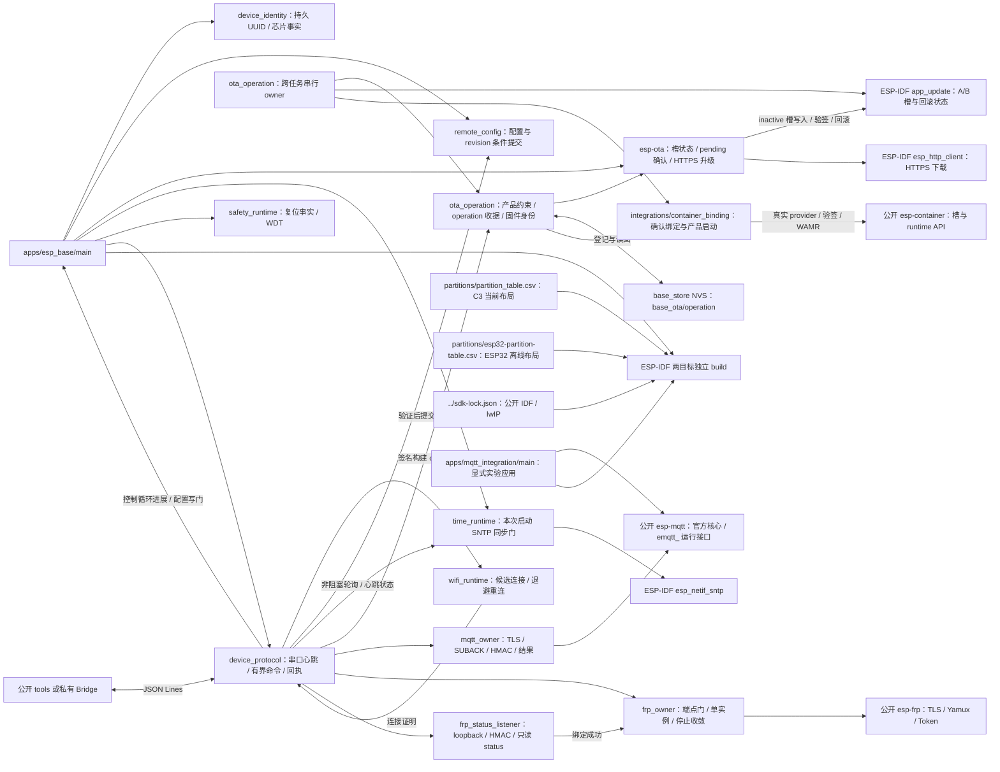

# ESP Base 固件

当前软件候选分别构建 ESP32-C3 的 USB 与 ESP32-D0WD-V3 的 UART0 命令运行面；两目标都有独立分区、OTA/签名策略和精确组件锁。ESP32 旧 AT 到新布局、双签名 Base 与真实启动链仍待受控迁移和实板验收。两者都不是五能力完成版本。

## 架构拓扑

从仓库根执行 `idf.py -C firmware build`，默认工具链固定 ESP-IDF v6.1 / esp32c3，SDK 源码按仓根 `sdk-lock.json` 精确锁定公开 IDF fork 与 esp-lwip。CMake 核对两个提交、工作树、其他子模块和实际 lwIP 组件路径。`sdkconfig.defaults` 只包含共同选项，C3 的原生 USB、现行分区表、纯 STA 与 TLS 客户端配置在 `sdkconfig.defaults.esp32c3`；FRP status 是本机明文 HTTP，不需要 TLS server。ESP32 的 UART0、独立分区、STA/TLS client 和 ECDSA v1 bootloader 所需的日志/分区 MD5 约束在 `sdkconfig.defaults.esp32`。现行 C3 保留两个 `0x1e0000` 应用槽；ESP32 使用两个 `0x120000` 应用槽和 `0x16000` 的 `base_store`。NVS 不自动擦除。两目标使用独立 build/sdkconfig 与 `dependencies.lock`／`dependencies.lock.esp32`，组件提交一致，target 精确分离；现存 ESP-AT 分区及 C3 分区均不能作为 ESP32 新布局。烧录前重新枚举并核对芯片、身份与两份完整 Flash 备份；不得用固定串口名识别设备，不执行 eFuse、整片擦除或执行器输出。

ESP32 未签名普通编译只允许显式 `-DESP_BASE_ESP32_OFFLINE_PROBE=ON`，并要求关闭硬件 Secure Boot 与签名输出；它只用于离线容量与源码检查，**绝非可刷写候选**。ESP32 签名构建必须提供仓外绝对路径的 P-256 签名键，并在独立 sdkconfig 中启用 `CONFIG_SECURE_SIGNED_APPS_NO_SECURE_BOOT=y`、`CONFIG_SECURE_SIGNED_APPS_ECDSA_SCHEME=y`、`CONFIG_SECURE_SIGNED_ON_BOOT_NO_SECURE_BOOT=y`、`CONFIG_SECURE_SIGNED_ON_UPDATE_NO_SECURE_BOOT=y`、`CONFIG_SECURE_BOOT_BUILD_SIGNED_BINARIES=y` 与 rollback；CMake 会拒绝缺失或错目标。测试键只用于仓外软件验证，不能作为设备首次启动密钥。签名 bin 还必须经固定 SDK 的 `espsecure verify-signature --version 1` 验证，并核对双槽与分区表。旧 ESP-AT 板卡的新启动链、两个已签名 Base 槽、otadata、旧区归档与完整恢复仍待 P7-01 受控实板验收。

[嵌入式标准](https://github.com/darren-you/darren-space/blob/master/harness/docs/workspace/standards/embedded_firmware/embedded_firmware_golden_path.md)。测试在 `tests/`，公开主机调用示例在固件根之外的 [tools/](../tools/README.md)。Component Manager 依赖由两个 target 专属锁固定；`mqtt` 唯一来源是公开 `esp-mqtt@9d6d95e779f4f5ff387a6d9b54015bf4e43565f2`，`esp_ota` 唯一来源是公开 `esp-ota@207273188b984161362824c3344614e812016836`，`esp_frp` 唯一来源是公开 `esp-frp@1f0c8f37db3765a74b3b95871bb266d0c73d1248`。host tests 使用同一已解析 cJSON、`eota.h` 与 `esp_frp.h`，不读取相邻仓。

默认 `ESP_BASE_APP=esp_base` 保留普通 USB/Wi-Fi 基座，并只读装载 v3 持久配置，经物理 USB `config.set` 写入完整 Wi-Fi/MQTT/FRP 凭据；未配置时不创建相应客户端。MQTT 已配置时只在 Wi-Fi IP 和本次启动可信时间齐备后启动严格 TLS，会在 command SUBACK 后报告 ready，并通过同一控制任务执行已认证命令、发布 QoS 1 结果和脱敏 reported；远端 config.set 被拒绝。显式 `ESP_BASE_APP=mqtt_integration` 构建[隔离 MQTT 测试应用](apps/mqtt_integration/README.md)，要求仓外私有输入与独立 build/sdkconfig，沿用同一分区。普通应用拒绝实验输入和明文选项；测试应用具有实验标记。现有实板仍为 v1 存储，未完成双槽与 NVS 离线迁移前不得启动 v3-only 镜像；正式 Broker/Tool 和实板网络 ACK 闭环尚待联调。FRP owner 只有独立 HMAC 鉴权的只读 HTTP listener 成功绑定配置中的 `127.0.0.1:local_port` 后才允许启动；端点失败仍报告 `endpoint_unavailable`。当前只完成软件装配，不表示 P4-05 或真实 FRPS 闭环完成。

普通应用仅在本地启动检查成功、控制循环已实际运行且持续 30 秒报告进展，并跨过窗口终点再完成一轮后确认 pending OTA 槽；构建要求 `CONFIG_BOOTLOADER_APP_ROLLBACK_ENABLE=y`。pending 窗口内拒绝 `config.set`，确认后恢复。SDK 确认失败后读回持久槽状态，若已 VALID 则清门。无可回退镜像时当前执行虽保留，下次复位仍有失去可启动槽风险。控制循环进展的 5 秒阈值是策略值，复杂负载、真实新槽和回滚仍待实板验收。

普通应用从编译期 `CONFIG_ESP_BASE_TIME_SERVER` 初始化 SNTP，默认 `pool.ntp.org`；控制任务每秒非阻塞查询一次同步结果。`time_ready` 只在本次 boot 收到有效同步事件后为 true。时间失败不阻塞 USB 控制或 pending 本地确认；签名构建的 HTTPS OTA 在无可信时间时拒绝启动。服务器不写 NVS；时间同步与 Wi-Fi 重连仍待实板验收。

C3 签名构建要求 `CONFIG_SECURE_SIGNED_APPS_NO_SECURE_BOOT=y`、`CONFIG_SECURE_SIGNED_ON_UPDATE_NO_SECURE_BOOT=y`、RSA-3072、证书包和构建签名密钥。ESP32-D0WD-V3 的同一 SDK 构建使用 ECDSA v1 P-256 方案；签名构建必须选择对应 Kconfig，不能复制 C3 的 RSA policy。当前未签名实板不能直接打开这些选项：IDF 在签名配置启动时需要运行镜像中的公钥。首次迁移必须保全原设备、核对旧 bootloader 的 rollback、建立已签名且 otadata 为 VALID 的基座与回退槽；本轮只使用仓外临时测试键编译，不写板卡或生成生产凭据。签名构建的软件路径检查完整 signed bin 长度、inactive 槽大小、project/芯片、SHA-256 与 IDF 签名结果，下载/配置提交互斥；外部串口 Flash 租约仍由工具侧控制。

`ota.start` 在目标槽写入前将 operation ID、设备 ID、摘要、长度与源/目标槽作为单 blob 保存到 `base_store` 的 `base_ota/operation`，commit 和读回成功才启动 worker；同 ID 不再次下载。签名构建的只读 `ota.result` 查询最近一次收据，只有新槽本地确认 VALID 且完整运行镜像摘要匹配才成功；回滚到尚无查询代码的旧镜像不能由设备提供最终结果，工具必须记 unknown。身份 NVS 保持原位；配置仍用 `base_config/committed` 单键，v3-only 读写不兼容旧 v1/v2 记录。真实回滚和 NVS 掉电行为待实板验证。

`ota_operation` 另提供只读固件集合观察：已确认模式要求运行槽 `VALID`；显式 pending trial 模式要求运行槽 `PENDING_VERIFY`、另一槽 `VALID` 且 IDF 证明可回滚。prepared candidate 模式需要本次 `eota_prepare` 的收据，要求 A 仍运行且被选为 boot、otadata 为 `VALID`，C 未选 boot 且旧 inactive otadata 已失效；重新验签 A/C 并核对 C 的完整长度/摘要。三种模式都要求运行槽与当前 boot selector 一致，拒绝过程中变化。已确认模式中若另一槽未受管，只有镜像校验明确无效才输出单固件集合。调用方在观察及消费结果期间独占 app/otadata 写入；prepared 观察现由无包 OTA worker 在选 boot 前持久 stage，pending 观察用于候选 trial。

本次 boot 的启动存储操作和 pending 确认持有 `ota_operation` 串行 owner；完成后释放，已启动 guest 不长期占用。`ota.start` 在持久登记前取得 claim，跨控制任务与 worker 保持到下载、验签和选择完成。未知选择或存储结果保留本 boot claim；可证明失败并记账后释放。[Container 产品装配](integrations/container_binding/README.md)复用启动已持有的 claim，不二次争抢。策略完整且持久无包绑定时，首次确认启动可初始化，后续固件 OTA 依精确 prepared 收据 stage、pending trial 和 OTA VALID 回读确认；现有 confirmed 包仍可验签启动。带包升级在写 inactive app 前拒绝；准备期间旧备用槽被覆盖却未持久 stage 的断电恢复仍缺合同，不能把本 boot 的 claim 当作跨重启恢复。

MQTT 装配要求 `CONFIG_MBEDTLS_HAVE_TIME_DATE=y` 和 `CONFIG_MQTT_REPORT_DELETED_MESSAGES=y`。新 sdkconfig 从 defaults 得到这些值；已有 sdkconfig 若显式关闭，需在 menuconfig 启用，编译器会拒绝缺少日期验证或消息过期通知的配置。

FRP 组件还要求 `CONFIG_MBEDTLS_MD5_C=y`、`CONFIG_LWIP_SO_LINGER=y` 和至少 12 个 lwIP socket；默认配置与 CMake 同时检查。普通镜像中保留库符号只证明编译组合，不能代替真实管理端点、FRPS/MQTT 同时运行或堆峰值测量。
