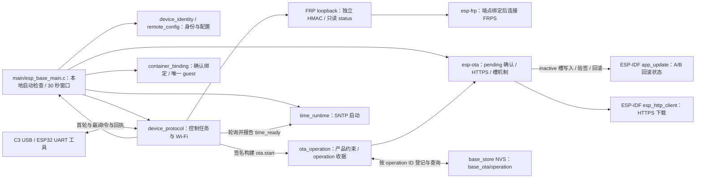

# 无业务基座应用

装配身份、完整配置读取、Wi-Fi、SNTP 同步门、槽状态、复位事实、串口心跳及 status/restart/config.set 命令；无包产品的 pending 新槽通过本地启动检查、控制循环进展与 30 秒窗口后确认。配置 Container 产品授权时仅装载现有 confirmed 绑定；pending 在联合 OTA 合同完成前请求回滚。不配置 GPIO。

## 架构拓扑

在仓库根使用 `idf.py -C firmware build` 构建 C3；ESP32 的未签名离线构建还须显式 `-DIDF_TARGET=esp32 -DESP_BASE_ESP32_OFFLINE_PROBE=ON`，签名构建须满足固件根 README 的仓外 ECDSA v1 输入。此 v3-only 应用只接受 `base_store/base_config/committed` 的 EBCF v3 blob；已有 v1/v2 记录在启动读取阶段失败，不写 NVS、不确认 pending 槽。实板须先完成离线双槽与同键迁移；物理 C3 USB／ESP32 UART `config.set` 可在 v3 首启后写入完整 MQTT/FRP 凭据；MQTT 客户端和 FRP loopback 只读 `status` 端点已有软件接线。FRP 仍缺实际请求到板、MQTT/OTA 并行与资源验收；本地编译不能证明 FRPS 可用。

先读取运行槽状态，再进行 NVS、身份、配置与控制任务初始化。Wi-Fi 驱动初始化失败只将网络状态标为 `failed`，不阻止串口控制任务启动。pending 槽需在 5 秒内看到控制循环首轮完成，在之后的 30 秒内每秒核对最近进展不超过 5 秒，窗口结束后还要等待控制循环完成新一轮，最多再等 5 秒；此期间 `status` 可读、`config.set` 返回 `ota_verification_pending`，确认成功后恢复配置写入。确认 API 失败后若持久状态已为 VALID，仍清门；其它不确定状态输出 `ESP_BASE_OTA_RECOVERY_REQUIRED`。检查失败调用 IDF 标记无效并重启回滚；无可回退镜像时不强制重启，但后续复位不能保证可启动。网络在线不是本地确认条件。5 秒是当前活性策略值，真实 OTA/回滚仍需实板验证。

控制任务启动后以编译期 `CONFIG_ESP_BASE_TIME_SERVER` 初始化 SNTP，默认 `pool.ntp.org`；初始化失败只报告 `ESP_BASE_TIME_UNAVAILABLE`，不影响 pending 本地确认。心跳 `time_ready` 只有本次 boot 收到有效同步后才为 true。签名构建的 `ota.start` 要求 Wi-Fi IP 与该同步事实，随后在独立 worker 下载；普通未签名构建明确拒绝。服务器名称不写持久配置。

签名构建的 `ota.start` 先登记最近一次 `base_store/base_ota/operation` 收据并核对持久读回，再启动独立下载任务；只读 `ota.result` 在旧/新 boot 按 operation ID 查询。下载任务活跃及新槽 pending 为 running，只有本地确认 VALID 且运行镜像完整摘要匹配才 succeeded。旧回滚镜像若未包含查询实现则不能消费新收据，工具只可报告 unknown。
