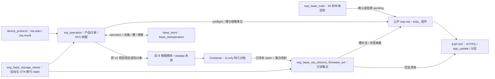

# ota_operation

Base 自有的 OTA 产品约束、持久 operation 收据和只读固件集合观察。两个 target 均固定项目 `esp_base`：C3 使用 `esp32c3/esp_base`、RSA v2、双 `0x1e0000` 应用槽；ESP32 使用 `esp32/esp_base`、ECDSA v1、双 `0x120000` 应用槽。芯片 ID、槽地址与下载期限由编译目标决定，`ota.start` 请求不能修改这些约束。收据保存在 `base_store/base_ota/operation`，首次目标槽写入前必须 commit 并逐字节读回。同 operation ID 不重新下载，前次结果未决时不覆盖唯一收据。

同一 NVS key 的 V2 收据还保存签名运行 A、原独立备用 B（A-only 或两槽同一签名身份时为零）、目标 C 的摘要，A/B 物理 subtype、C 长度，以及配置 Container 时已对账的 ECS2 sequence。注册使用已持有的串行 owner，消费产品装配提供的 ECS2 snapshot，并立即重复 Base 的 `CONFIRMED` 签名固件集合观察；任一字段不一致就拒绝登记，不擦除任何 app 槽。启动端通过 `esp_base_ota_receipt_load_for_recovery` 读取原 `PREPARED` 意图，只有它可以授权对确切 inactive 槽做断电清理；`FAILED` 是目标槽写入前可证明失败，或写入后完成本地中断清理和 ECS2 对账的终态，不授权再次擦槽。旧 V1、损坏或读失败的 blob 一律返回存储不确定，不能当作空 key 或自动写入新操作。`ota.result` 不因目标 otadata 单独变为 `INVALID`／`ABORTED` 就推断失败；未清理的 `PREPARED` 保持 unknown，新操作继续被阻断。

## 架构拓扑

通用 HTTPS 下载、镜像头/完整摘要、SDK 验签、槽观察、物理退役与确认/回滚均由锁定的 `esp-ota` 维护。`eota_validate_image_request` 与下载准备共用 HTTPS URL 和最小镜像头长度规则，在旧 B 首次擦除前先拒绝静态无效请求；本组件不保留这些实现或旧 `esp_base_ota_*` 转发入口。收据查询通过 `eota_observe_slots` 和 `eota_sha256_running` 读取当前事实：worker 活跃或新槽 pending 为 running，新槽 VALID 且完整 signed bin 摘要吻合、产品确认并持久写入读回 `SUCCEEDED` 收据后才 succeeded；A 仍运行且失败已持久记录才 failed，该失败须发生于目标槽写入前，或写入后完成原收据驱动的物理槽与 Container 对账。其余 unknown。存储写入或读回不确定时拒绝启动升级。普通未签名构建不登记收据。

当前实板仍是旧固件，签名首次迁移与真实 HTTPS、Flash、bootloader 回滚尚未验收；构建和 host 假件不代表实板结果。ESP32 的 16 KiB 旧 AT 归档及新分区表只提供离线候选，不允许直接向旧分区执行 OTA。

固件集合接口要求签名构建且调用方串行化 app/otadata 写入。调用方显式选择 `CONFIRMED`、`PENDING_TRIAL` 或 `PREPARED_CANDIDATE`：前者要求运行槽已确认 `VALID`；pending 要求运行槽 `PENDING_VERIFY`、另一槽 `VALID` 且经 IDF 证实可回滚。prepared 模式必须由成功的 `eota_prepare` 调用者传入其精确收据，仅用于 prepare 后、`eota_select` 前；A 仍运行且 boot selector 指向 A、状态 `VALID`，C 位于 inactive 槽且旧 otadata 为 `UNTRACKED`／`INVALID`／`ABORTED`，不能仍为 `VALID`、`NEW`、`PENDING_VERIFY` 或 `UNDEFINED`。收据的 prepare 前 A/C 几何、A 状态和原 inactive 状态也须与当时允许写入的事实一致。prepared 模式重新验签 A/C，并以 SDK 报告的完整签名长度、SHA-256 核对收据，拒绝与 A 相同的 C 身份；双次槽观察必须稳定。三种观察均要求运行槽等于下次启动槽。

运行镜像与涉及的另一镜像均通过 `eota_sha256_verified_image` 验签，再从精确 app 分区读回镜像头和 app 描述，核对 Base 项目名、芯片 ID、magic 与分区几何；签名身份本身不代表属于此产品。`CONFIRMED` 模式中另一槽为 `UNTRACKED`、`INVALID` 或 `ABORTED` 时，必须由 SDK 明确拒绝其镜像，且物理分区首字节读回 `0xff`，才可返回单固件集合；应用侧验签失败不能证明 bootloader 不会后备扫描。其它状态、可被 bootloader 回退扫描加载但未确认的镜像、读态变化、签名或资源失败都拒绝且清空输出。相同 signed bin 摘要合并为同一固件身份。接口不修改槽或发布业务包；产品 OTA worker 已在 `eota_prepare` 后消费精确 prepared 身份，Container 持久 stage 成功后才选 boot。Host 测试与双目标编译不证明实板启动资格。

`esp_base_storage_owner` 是本次 boot 内跨任务传递的唯一高层串行 claim：启动检查与 pending 确认、`ota.start` 的收据/下载/选择，以及 Container 产品装配共用它。产品调用方复用启动已持有的 claim；`esp_base_storage_claim_active` 仅检查此 claim，没有二次 claim。claim 不替代 Container provider 自己保护包 NVS/Flash 回调的独立信号量；当前 C3 没有包分区，不能视为包写入已串行化。

启动 claim 在产品装载前读取原 V2 收据。A 仍以 `VALID` 运行并被选为 boot 时，先调用 `eota_retire_inactive` 将精确 inactive 槽恢复为物理 A-only，再用收据中的 A/B/C 身份和 ECS2 sequence 令 Container 对账；两者成功后才把 `PREPARED` 更新为 `FAILED`。C 已选中运行且为 pending/VALID 时复核完整 signed bin 摘要、旧 A 签名与 IDF 回退资格；配置 Container 时还核对原 operation、A/C 身份与 ECS2 sequence，不把 C 当作清理目标。产品确认完成后才将 `PREPARED` 提交为 `SUCCEEDED`，提交或读回不确定则保留 unknown。恢复失败、旧 V1 收据或读回不确定均保持启动阻断；控制任务在恢复结束前不得开放配置写入与 MQTT/FRP owner。该路径未经过真实设备断电、NVS/Flash 中间态和 bootloader 回退验收。
