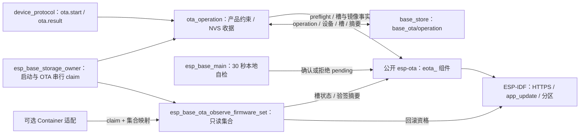

# ota_operation

Base 自有的 OTA 产品约束、持久 operation 收据和只读固件集合观察。两个 target 均固定项目 `esp_base`：C3 使用 `esp32c3/esp_base`、RSA v2、双 `0x1e0000` 应用槽；ESP32 使用 `esp32/esp_base`、ECDSA v1、双 `0x120000` 应用槽。芯片 ID、槽地址与下载期限由编译目标决定，`ota.start` 请求不能修改这些约束。收据保存在 `base_store/base_ota/operation`，首次目标槽写入前必须 commit 并逐字节读回。同 operation ID 不重新下载，前次结果未决时不覆盖唯一收据。

## 架构拓扑

通用 HTTPS 下载、镜像头/完整摘要、SDK 验签、槽观察与确认/回滚均由锁定的 `esp-ota` 维护；本组件不保留这些实现或旧 `esp_base_ota_*` 转发入口。收据查询通过 `eota_observe_slots` 和 `eota_sha256_running` 读取当前事实：worker 活跃或新槽 pending 为 running，新槽 VALID 且完整 signed bin 摘要吻合才 succeeded，明确失败或回滚才 failed，其余 unknown。存储写入或读回不确定时拒绝启动升级。普通未签名构建不登记收据。

当前实板仍是旧固件，签名首次迁移与真实 HTTPS、Flash、bootloader 回滚尚未验收；构建和 host 假件不代表实板结果。ESP32 的 16 KiB 旧 AT 归档及新分区表只提供离线候选，不允许直接向旧分区执行 OTA。

固件集合接口要求签名构建且调用方串行化 app/otadata 写入。调用方必须显式选择 `CONFIRMED` 或 `PENDING_TRIAL` 观察：前者要求运行槽为已确认 `VALID`；后者只允许运行槽为 `PENDING_VERIFY` 且另一槽确实 `VALID`、经 IDF 证实可回滚，为另行授权的联合试运行提供只读镜像身份，不批准也不启动试运行。两种观察均要求运行槽等于下次启动槽。运行镜像和可回退镜像都须先通过 `eota_sha256_verified_image` 验签，再从精确 app 分区读回镜像头和 app 描述，核对 Base 项目名、芯片 ID、magic 与分区几何；签名身份本身不代表属于此产品。`CONFIRMED` 模式中另一槽为 `UNTRACKED`、`INVALID` 或 `ABORTED` 时，只有 SDK 明确拒绝其镜像才可返回单固件集合。其它状态、可被 bootloader 回退扫描加载但未确认的镜像、读态变化、签名或资源失败都拒绝且清空输出。相同 signed bin 摘要合并为同一固件身份。它不修改槽或发布业务包，也未对真实设备证明启动资格。

`esp_base_storage_owner` 是本次 boot 内跨任务传递的唯一高层串行 claim：启动检查与 pending 确认、`ota.start` 的收据/下载/选择，以及可选 Container 适配共用它。claim 不替代 Container provider 自己保护包 NVS/Flash 回调的存储信号量；实际包调用方尚未装配，不能把当前 C3 镜像视为包写入已串行化。
