# Base 与 Container 产品装配

主应用编译本组件，并在启动时沿唯一 `ota_operation` claim 调用它。默认产品授权输入全部为空：C3 保持原无包分区流程；任一输入出现但合同不全，启动明确阻断并保留 claim。C3 当前分区表没有包分区；ESP32 `product_pkgs` 三槽仅是未冻结的离线候选，不可据此写板。

## 架构拓扑

```mermaid
flowchart LR
    main["esp_base_main：启动 claim"] --> binding["签名固件与 otadata 观察"]
    binding --> provider["真实分区 / 独立存储锁"]
    provider --> slots["无包初始化或既有绑定对账"]
    slots --> guest["confirmed 包验签、授权和唯一 pthread"]
    slots --> release["完成启动存储操作后释放 claim"]
    release --> ota["ota.start：同一 owner"]
    ota --> receipt["V2 收据：A/B/C 摘要、槽与 ECS2 sequence"]
    receipt --> retire["eota 擦除旧 B / Container 退役为 A-only"]
    retire --> prepared["prepare 后精确 A/C 观察与 NO_PACKAGE stage"]
    prepared --> select["选 boot"]
    select --> trial["C pending：BOOT_START_TRIAL / begin_trial"]
    trial --> health["本地窗口 / mark_healthy"]
    health --> confirm["OTA VALID 回读 / Container confirm"]
    receipt --> recovery["重启在产品装载前按原收据恢复"]
    recovery -->|"A 仍运行"| retire
```

`esp_base_container_with_firmware_set` 使用调用者**已持有**的 Base claim，不再二次 claim。它支持 `CONFIRMED`、`PENDING_TRIAL`，以及仅在 `eota_prepare` 成功后、`eota_select` 前使用精确收据的 `PREPARED_CANDIDATE`；每次逐字段映射实际可启动签名固件集合，执行一次 Container 操作后复读。不一致返回 `UNCERTAIN`。provider 的 NVS/Flash 信号量与 Base 高层 claim 分开。

产品策略通过 `Kconfig` 的显式构建输入提供：产品 ID、RSA-3072 PKCS#1 公钥 DER 十六进制与 key ID、包分区和 NVS 分区的真实 label/offset/size、三个绝对槽区域，以及独立的 Wasm 大小、栈、事件队列、指令、宿主调用、capability、timer/log 与入口期限上限。公钥必须来自仓外受控产品信任源；签名包中的请求不能扩大这些授权。固定 ABI 2 只接受一页 Wasm 线性内存，持久包记录使用指定 NVS 分区的 `base_pkg/slots`。受控测试输入只供仓外容量原型，不能冒充生产信任源。

在真实表中 `esp_container_slots_idf_bind` 校验包分区 `data/undefined`、NVS 分区、精确地址/大小、槽几何与可写属性。若指定 NVS key **确实不存在**，启动 claim 下的 `CONFIRMED` 双重观察先验证实际一个或两个签名 Base 固件，再通过公开 `econtainer_slots_initialize` 持久写入对应无包绑定；损坏、读失败或部分授权配置均不会被当成首装。既有绑定经 `reconcile` 对账。confirmed 包随后在唯一 `pthread` 中通过公开 `econtainer_product_open` 回读、映射、验签、验产品和授权，释放映射后执行 `init`；线程轮询已授权 timer 并排出 log。对账与装载结束后释放高层 claim，guest 存活不会长期占用 OTA owner；出错时保持阻断。

当前只允许**持久无包绑定**进入联合固件 OTA。`ota.start` 在同一 owner 下取得已对账的签名 A/原独立 B 与 ECS2 sequence，并在写 app 槽前持久登记和读回 V2 收据。worker 重新核对该收据后先调用 `eota_retire_inactive`：擦除确切 inactive 槽首扇区、读回首字节 `0xff`，使旧 B 的 otadata 失效，并核对 A 仍为 VALID 且被选为 boot；然后调用 `econtainer_slots_retire_inactive_firmware` 将 A/B 持久绑定退役为 A-only。原本已是 A-only 时仍验证物理单槽事实和原 sequence。只有退役完成才运行 `eota_prepare` 下载 C，以 prepare 收据重新核对 A/C，调用 `econtainer_slots_stage_firmware(NO_PACKAGE)` 持久 stage，成功后才 `eota_select`。C 的 `PENDING_VERIFY` boot 必须由 Container 返回精确 `BOOT_START_TRIAL`，先 `begin_trial`，再经过 Base 本地控制进展与稳定窗口、`mark_healthy`、`eota_confirm_pending`、VALID 与签名集合回读，最后 `confirm`。C 已 VALID 而 Container 仍为 `HEALTH_VERIFIED` 的复位恢复，在本 boot 完成本地基本检查后，用持久旧 `trial_boot_id` 补交 confirm。

重启后的启动 claim 在产品装载前读取原 V2 收据。A 仍运行且为 VALID、boot selector 仍指向 A 时，按收据再调用物理退役，清除可能只写了一部分的 C；Container 恢复只接受原 ECS2 sequence 所限定的 A/B 或 A-only，或与原 operation ID、C 摘要和不同 boot ID 相符的 NO_PACKAGE `PREPARED`、`TRIAL_STARTED`、`HEALTH_VERIFIED`、`ABORTED` 状态，必要时执行 `abandon` 和 `drop_aborted_firmware`，最终复读 A-only。三层都对账成功后才把原收据记为 `FAILED` 并继续产品启动。C 已被选中并运行时复核 pending/VALID、完整签名 C 与旧 A 的签名及 IDF 回退资格；配置 Container 时还要核对原 operation、A/C 身份与 ECS2 sequence，绝不把 C 当作 inactive 槽擦除。随后走 trial 或已确认启动，产品确认完成后再持久写入读回 `SUCCEEDED` 收据。旧 V1、损坏或读失败收据、身份/sequence 不匹配和任何存储不确定都阻断产品启动，不能改写成新的空状态。

带包产品在 OTA 写 inactive app **之前**拒绝：Base 尚无真实业务事件来源与代表性事件授权，不能以 `init`、平台管理命令或可选 timer 冒充 guest 事件进展。Container 已提供 REUSE 与 WRITE 状态合同，但 Base 目前也没有新包来源；两条路径仍未接线。已确认包的正常启动入口继续可用。退役、下载、签名、stage 或选 boot 中事实不确定时，worker 留住本 boot 的 claim 并报告 `unknown/storage_uncertain`，不会当作普通失败释放；claim 本身不跨重启，跨重启恢复仅由原 V2 收据授权。上述是软件恢复合同，host 假件不能模拟实板掉电时的 Flash/NVS 原子性、bootloader 后备扫描、双槽迁移或 guest 与 FRP/MQTT 并发。

当前清单精确锁定 `esp-container@bf52b17a26e51d35a261bf852ac0c9cde76adefc` 与 WAMR `26c235e53e29acd8b43abe7f3b524577bd4d1ae5`。此前旧 `esp-container@5c807400c49158c3283686f18617b28f0f962868` 的 943,056 字节未签名 ESP32 产品离线 ELF，以及 1,114,100 字节测试键签名 ESP32 镜像和 ECDSA v1 验签，只是历史证据，不代表当前锁的容量。当前软件恢复接线的构建和测试证据见[开发检查点](../../../docs/operations/development-checkpoint.md)。默认 C3 无包分区与产品授权，不运行 guest；ESP32 仍只有仓外产品测试输入和离线布局。没有持久实板包、掉电恢复或实板资源测量，不能宣称 guest 或五能力运行验收。

当前 Base `3df1c33` 与上述精确锁又以仓外测试产品策略完成两目标深链接核验，两个 ELF 都确实包含 `econtainer_product_open` 与 WAMR load/instantiate/call。ESP32 测试键 ECDSA v1 签名镜像为 `0x10fff4`，官方验签通过，双 `0x120000` app 各余 `0x1000c`。C3 仅在隔离副本使用三 `0x82000` 包槽与双 `0x118000` app 的候选表，测试键 RSA v2 签名中间镜像为 `0x121000`，官方容量门判每槽溢出 `0x9000`，所以该布局没有可用构建。证据与隔离改动见[开发检查点](../../../docs/operations/development-checkpoint.md)；没有把测试策略、候选 C3 表或密钥写入本仓。
