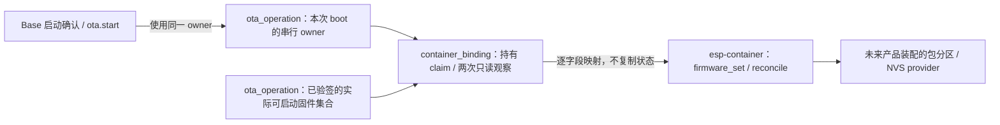

# Base 与 Container 固件集合适配

这是可选的编译与主机测试接线，当前业务 Base 应用不调用本目录，也不安装、运行或切换业务包。C3 当前分区表没有独立 `data/undefined` 包分区；ESP32 离线新表已有 `product_pkgs` 几何，但尚未在板上迁移、挂载或验证容量。

## 架构拓扑

`esp_base_container_with_firmware_set` 非阻塞取得与 Base 启动、`ota.start` 共用的 owner claim；无法取得即返回 `BUSY`。在 claim 内显式采用 `CONFIRMED` 模式调用 `esp_base_ota_observe_firmware_set`，逐字段映射到 `econtainer_slot_firmware_set_t`，执行调用方的单次 Container 操作，再观察一次。任何未签名、pending、槽状态/摘要歧义或调用期间变化都返回 `UNCERTAIN`。`esp_base_container_reconcile` 在该流程中直接调用 Container 的真实 `reconcile`；不确定时清空状态并保持 `BOOT_BLOCKED`。新观察接口的 `PENDING_TRIAL` 模式尚未接到本适配或主应用，不能绕过启动期 owner。Container provider 的内部存储信号量由其自身操作取得，不能把同一个非递归信号量同时作为外层 claim。

Container 回调已开始却返回 `UNCERTAIN`，或回调前后固件集合不一致时，本次 boot 保留 claim；新 OTA 或包操作不得在无法证明的组合上继续。若回调前的只读观察就失败，则释放 claim，以便日后重新观察。持久状态只能在新 boot 重新对账后继续裁决。

Base 在启动检查直到 pending 确认/失败期间持有 owner。`ota.start` 在登记收据前取得 claim，跨控制任务与下载 worker 保持到准备及选择目标槽结束；成功选择后持有到设备重启，明确失败且收据已确认记录后才释放，不明结果保留 claim 阻止后续操作。可选适配使用同一 owner，但当前应用没有产品调用方，Container 的包记录/Flash 写入尚未通过此入口装配；跨仓联合 OTA、实板回滚与包恢复仍未验收。

Host `bash firmware/tests/run_host_tests.sh` 使用假 Container 类型和结果测试映射、busy、歧义及前后快照变化。固定 SDK 的可选 C3 组件编译需从隔离 checkout 执行，在常规 Base defaults 后附加 `esp-container/examples/c3-runtime/sdkconfig.defaults`，并传 `-DESP_BASE_CONTAINER_BINDING_PROBE=ON`。Base 在 `project()` 前按该组件的 CMake profile 开启指令计量，并关闭 bulk、shared 与 shrunk memory。这个开关加入精确公开 `esp-container@8eb805f3f12cb3cd836e9833acb4aca878ae80e7` 及其固定 WAMR `26c235e53e29acd8b43abe7f3b524577bd4d1ae5`，只验证组件装配和编译。组件静态库含 runtime/slots 入口，主应用 ELF 未链接这些入口且没有包操作调用方。Component Manager 为探针生成的七依赖锁只在隔离副本中，常规 Base 锁不加入 Container/WAMR。构建不写设备，也不证明包分区、RAM 峰值、P7-02 五能力组合或运行闭环。

ESP32 离线目标也已在独立副本叠加 `esp-container/examples/esp32-runtime/sdkconfig.defaults`，以 `-DIDF_TARGET=esp32 -DESP_BASE_CONTAINER_BINDING_PROBE=ON -DESP_BASE_ESP32_OFFLINE_PROBE=ON` 从空目录全量构建。生成锁精确包含五仓与 WAMR，`container_binding` 静态库编译通过；未签名 `esp_base.bin` 为 850,432 字节。这个探针没有链接 Container 入口到主应用，不能刷写设备或证明五能力运行。
