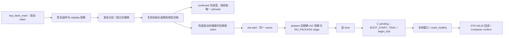

# Base 与 Container 产品装配

主应用编译本组件，并在启动时沿唯一 `ota_operation` claim 调用它。默认产品授权输入全部为空：C3 保持原无包分区流程；任一输入出现但合同不全，启动明确阻断并保留 claim。C3 当前分区表没有包分区；ESP32 `product_pkgs` 三槽仅是未冻结的离线候选，不可据此写板。

## 架构拓扑

`esp_base_container_with_firmware_set` 使用调用者**已持有**的 Base claim，不再二次 claim。它支持 `CONFIRMED`、`PENDING_TRIAL`，以及仅在 `eota_prepare` 成功后、`eota_select` 前使用精确收据的 `PREPARED_CANDIDATE`；每次逐字段映射实际可启动签名固件集合，执行一次 Container 操作后复读。不一致返回 `UNCERTAIN`。provider 的 NVS/Flash 信号量与 Base 高层 claim 分开。

产品策略通过 `Kconfig` 的显式构建输入提供：产品 ID、RSA-3072 PKCS#1 公钥 DER 十六进制与 key ID、包分区和 NVS 分区的真实 label/offset/size、三个绝对槽区域，以及独立的 Wasm 大小、栈、事件队列、指令、宿主调用、capability、timer/log 与入口期限上限。公钥必须来自仓外受控产品信任源；签名包中的请求不能扩大这些授权。固定 ABI 2 只接受一页 Wasm 线性内存，持久包记录使用指定 NVS 分区的 `base_pkg/slots`。受控测试输入只供仓外容量原型，不能冒充生产信任源。

在真实表中 `esp_container_slots_idf_bind` 校验包分区 `data/undefined`、NVS 分区、精确地址/大小、槽几何与可写属性。若指定 NVS key **确实不存在**，启动 claim 下的 `CONFIRMED` 双重观察先验证实际一个或两个签名 Base 固件，再通过公开 `econtainer_slots_initialize` 持久写入对应无包绑定；损坏、读失败或部分授权配置均不会被当成首装。既有绑定经 `reconcile` 对账。confirmed 包随后在唯一 `pthread` 中通过公开 `econtainer_product_open` 回读、映射、验签、验产品和授权，释放映射后执行 `init`；线程轮询已授权 timer 并排出 log。对账与装载结束后释放高层 claim，guest 存活不会长期占用 OTA owner；出错时保持阻断。

当前只允许**持久无包绑定**进入联合固件 OTA。OTA worker 在写 inactive app 前检查产品状态，取得同一 owner；`eota_prepare` 后以收据重新核对 A/C，调用 `econtainer_slots_stage_firmware(NO_PACKAGE)` 持久替换旧备用 B 身份，成功后才 `eota_select`。C 的 `PENDING_VERIFY` boot 必须由 Container 返回精确 `BOOT_START_TRIAL`，先 `begin_trial`，再经过 Base 本地控制进展与稳定窗口、`mark_healthy`、`eota_confirm_pending`、VALID 与签名集合回读，最后 `confirm`。C 已 VALID 而 Container 仍为 `HEALTH_VERIFIED` 的复位恢复，在本 boot 完成本地基本检查后，用持久旧 `trial_boot_id` 补交 confirm。回退至 A 时只选择 A confirmed；在 otadata 表明 C 已未选或失效后显式 `abandon`，仅当签名观察证明 C 不再可启动时才 `drop_aborted_firmware`。完整签名 C 即使标为 otadata 无效，也不会被假定不可启动。

带包产品在 OTA 写 inactive app **之前**拒绝：Base 尚无真实业务事件来源与代表性事件授权，不能以 `init`、平台管理命令或可选 timer 冒充 guest 事件进展。Container 已提供 REUSE 与 WRITE 状态合同，但 Base 目前也没有新包来源；两条路径仍未接线。已确认包的正常启动入口继续可用。若已进入 `eota_prepare` 后发生下载、签名、stage 或选 boot 失败，旧 B 可能已被覆盖；worker 留住本 boot 的 claim 并报告 `unknown/storage_uncertain`，不会当作普通失败释放。**claim 不跨重启**：重启后旧 A 仍可启动，但陈旧 A/B blob 对实际 A/C 或 A/无效 B 的集合对账会阻断产品启动。要自动恢复，仍需在覆盖 B 之前持久写入旧备用身份退役意图及受控恢复合同；本切片不宣称该故障已闭合。

固定 SDK `578cf89c343e388db43ba1f4ddcd602fedcb763c` 对两目标编译、host ASan/UBSan 测试已通过；产品组件精确锁定 `esp-container@5c807400c49158c3283686f18617b28f0f962868` 与 WAMR `26c235e53e29acd8b43abe7f3b524577bd4d1ae5`。默认 C3 无授权配置的 ELF 不运行 guest。仓外 RSA 测试公钥与 ESP32 候选几何下，未签名离线 ESP32 ELF 含真实 initialize/stage/begin_trial/health/confirm、provider 与 WAMR open/init；`esp_base.bin` 为 943,056 字节，双 `0x120000` app 槽各余 236,592 字节。同一仓外产品测试输入加临时 ECDSA v1 签名键的软件构建为 1,114,100 字节，每槽余 65,548 字节，固定 `espsecure verify-signature --version 1` 验签通过；该键不是设备信任锚或刷机候选。没有持久实板包、网络并发或实板资源测量，不能宣称 guest 或五能力运行验收。
