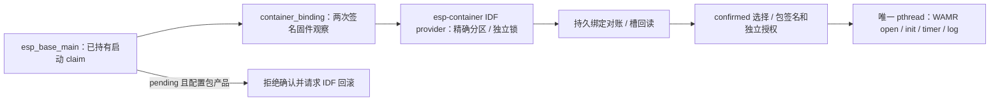

# Base 与 Container 产品装配

主应用编译本组件，并在启动时沿唯一 `ota_operation` claim 调用它。默认产品授权输入全部为空：C3 保持原无包分区流程；任一输入出现但合同不全，启动明确阻断并保留 claim。C3 当前分区表没有包分区；ESP32 `product_pkgs` 三槽仅是未冻结的离线候选，不可据此写板。

## 架构拓扑

`esp_base_container_with_firmware_set` 使用调用者**已持有**的 Base claim，不再二次 claim。它显式选 `CONFIRMED` 或 `PENDING_TRIAL` 只读观察，逐字段映射实际可启动固件摘要，执行一次 Container 操作并复读；不一致时返回 `UNCERTAIN`。适配本身支持 pending 身份事实，产品启动只允许 confirmed。provider 的 NVS/Flash 信号量与 Base 高层 claim 分开，不能复用非递归锁。

产品策略通过 `Kconfig` 的显式构建输入提供：产品 ID、RSA-3072 PKCS#1 公钥 DER 十六进制与 key ID、包分区和 NVS 分区的真实 label/offset/size、三个绝对槽区域，以及独立的 Wasm 大小、栈、事件队列、指令、宿主调用、capability、timer/log 与入口期限上限。公钥必须来自仓外受控产品信任源；签名包中的请求不能扩大这些授权。固定 ABI 2 只接受一页 Wasm 线性内存，持久包记录使用指定 NVS 分区的 `base_pkg/slots`。受控测试输入只供仓外容量原型，不能冒充生产信任源。

在真实表中 `esp_container_slots_idf_bind` 校验包分区 `data/undefined`、NVS 分区、精确地址/大小、槽几何与可写属性后，才初始化指定 NVS 分区。没有持久绑定时返回 `EMPTY`，**不自动创建绑定、不写包槽**。现有 confirmed 绑定经 `reconcile`、精确 sequence 和固件集合选择后，再在唯一 `pthread` 中通过公开 `econtainer_product_open` 重新回读、映射、验签、验产品和授权，释放映射，然后 `init`。线程轮询已授权 timer 并将已授权 log 以十六进制输出；失败时 stop/close，Base claim 保留。没有通用业务事件来源，因此本切片不声称事件接入完成。

配置包产品时，当前 `PENDING_VERIFY` 固件在启动检查后明确拒绝确认并请求 IDF 回滚；`ota.start` 在产品 configured 的 `EMPTY/RUNNING/BLOCKED` 状态下因启动 claim 持续被占用而返回 `BUSY`。这防止尚无联合 OTA 持久转换合同的产品产生孤立新固件。`ota_operation` 已增加 prepare 成功至选 boot 前的 `PREPARED_CANDIDATE` 签名 A/C 观察，但产品 OTA worker 和本适配尚未消费它。后续须由 Container 在此窗口持久化 package-write／reuse／no-package 的固件转换，再由 Base 选 boot；新 boot 使用精确 trial/health/confirm 状态，并处理回滚候选。不得猜 otadata，也不得直接改 Container blob。

固定 SDK `578cf89c343e388db43ba1f4ddcd602fedcb763c` 对两目标编译、两组 host 测试已通过；产品组件锁定 `esp-container@b8c86afbcf9d5ae827fe1d2cb79d12ad643b38b3` 与 WAMR `26c235e53e29acd8b43abe7f3b524577bd4d1ae5`。默认 C3 无授权配置的 ELF 会消去不可达的 Container 调用。仓外 RSA 测试公钥和 ESP32 候选几何下，未签名离线 ESP32 ELF 的 `nm` 含真实 `econtainer_product_open/init`、IDF provider 和 WAMR loader，`esp_base.bin` 为 934,912 字节，双 `0x120000` app 槽各余 244,736 字节。此构建没有持久包、已签名产品 app、网络并发或实板资源测量，不能运行 guest 或刷写设备。
